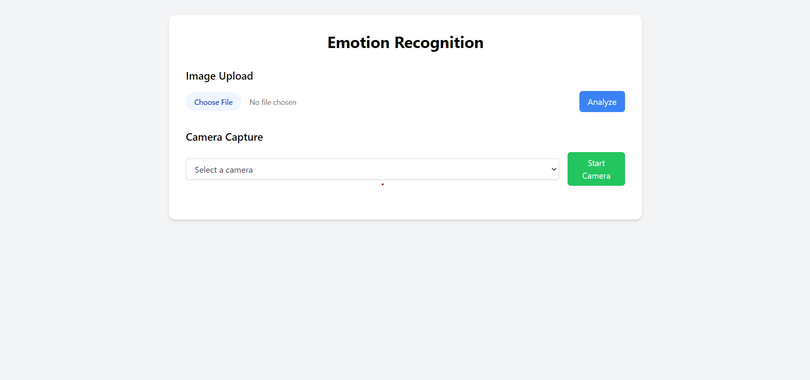
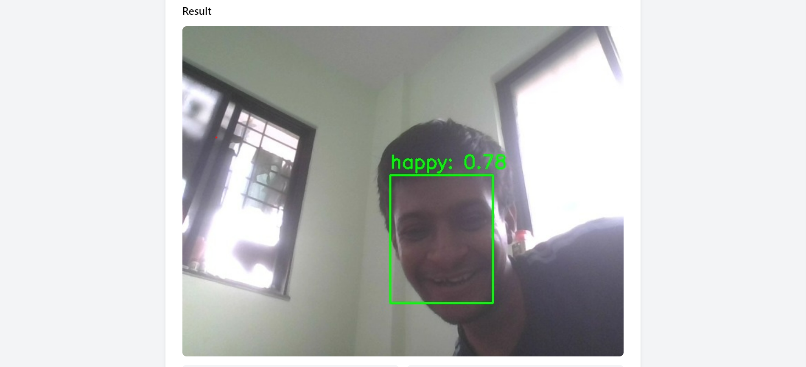

# Emotion Recognition Application

## Overview

This Emotion Recognition Application is a web-based tool that allows users to upload images or capture photos using their device's camera and analyze the emotions displayed in the faces detected. It uses Python with Flask for the backend, and HTML/CSS with JavaScript for the frontend. The application features a responsive design and utilizes the FER (Facial Expression Recognition) library for emotion detection.

## Features

- Image upload for emotion analysis
- Camera capture with device selection
- Real-time emotion detection
- Responsive web design
- Support for multiple camera devices
- Visualization of detected emotions with confidence scores

## Screenshots

Here are some screenshots demonstrating the application's features:

### Main Interface

*The main interface of the application showing image upload and camera options.*


### Camera Capture Result

*Result of emotion analysis after capturing an image from the camera.*

## Prerequisites

Before you begin, ensure you have met the following requirements:

- Python 3.7 or higher
- pip (Python package manager)
- A modern web browser
- Webcam (for camera capture feature)

## Installation

1. Clone the repository:
   ```
   git clone https://github.com/yourusername/emotion-recognition-app.git
   cd emotion-recognition-app
   ```

2. Create a virtual environment (optional but recommended):
   ```
   python -m venv venv
   source venv/bin/activate  # On Windows use `venv\Scripts\activate`
   ```

3. Install the required packages:
   ```
   pip install -r requirements.txt
   ```

## Usage

1. Start the Flask application:
   ```
   python app.py
   ```

2. Open a web browser and navigate to `http://127.0.0.1:5000/`

3. You can use the application in two ways:
   - Upload an image file for analysis
   - Capture an image using your device's camera

4. For camera capture:
   - Select a camera from the dropdown menu
   - Click "Start Camera" to initialize the video feed
   - Click "Capture Image" to take a photo and analyze it

5. The application will display the analyzed image with detected faces highlighted and the dominant emotion labeled. Below the image, you'll see a breakdown of detected emotions with confidence scores.

## Project Structure

```
emotion-recognition-app/
│
├── app.py                 # Main Flask application
├── requirements.txt       # Python dependencies
├── README.md              # This file
│
├── templates/
│   └── index.html         # HTML template for the web interface
│
└── screenshots/           # Directory containing application screenshots
    ├── main_interface.png
    ├── image_upload_result.png
    ├── camera_capture.png
    └── camera_capture_result.png
```

## Technologies Used

- Backend:
  - Flask: Web framework for Python
  - FER: Facial Expression Recognition library
  - OpenCV: Computer vision library for image processing
  - NumPy: Numerical computing library
  - Pillow: Python Imaging Library

- Frontend:
  - HTML5
  - JavaScript (ES6+)
  - Tailwind CSS: Utility-first CSS framework

## Contributing

Contributions to improve the application are welcome. Please follow these steps:

1. Fork the repository
2. Create a new branch (`git checkout -b feature-branch`)
3. Make your changes and commit them (`git commit -am 'Add some feature'`)
4. Push to the branch (`git push origin feature-branch`)
5. Create a new Pull Request


## Acknowledgments

- [FER (Facial Expression Recognition)](https://github.com/justinshenk/fer) for emotion detection
- [Flask](https://flask.palletsprojects.com/) for the web framework
- [Tailwind CSS](https://tailwindcss.com/) for the UI styling

## Troubleshooting

- If you encounter issues with camera access, ensure that your browser has permission to access the camera.
- For deployment, note that camera access typically requires HTTPS for security reasons.
- If emotion detection seems inaccurate, try adjusting lighting conditions or camera angle for better face visibility.